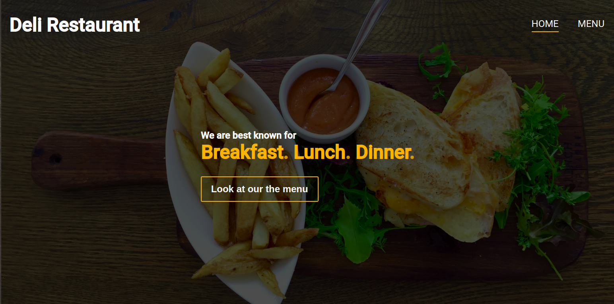

# JS Restaurant [Live Link](#)

- JavaScript ES6 DOM manipulation by dynamically rendering a simple restaurant homepage



## Usage
> Clone the repository to your local machine using ssh:
```
$ git clone git@github.com:rOluochKe/JS-Restaurant.git
```
> Clone the repository to your local machine using https:
```
$ git clone https://github.com/rOluochKe/JS-Restaurant.git
```
> cd into the directory
```
$ cd JS-Restaurant
```
> Run Server Locally


## Functionalities
- The classic restaurant homepage
- DOM manipulation
- DOM rendering
- Vanilla Javascript
- Designed in HTML5 and CSS3

## Designed and developed by
- [Raymond Oluoch](https://github.com/rOluochKe)
